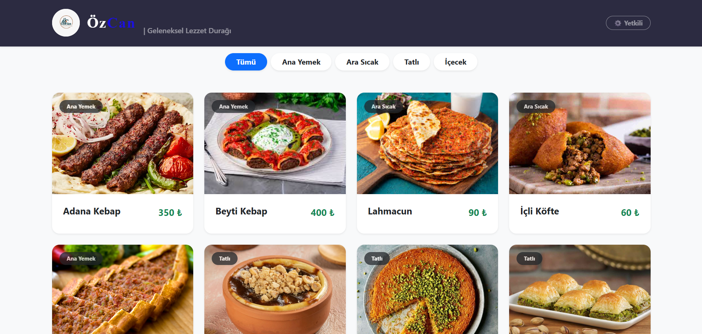
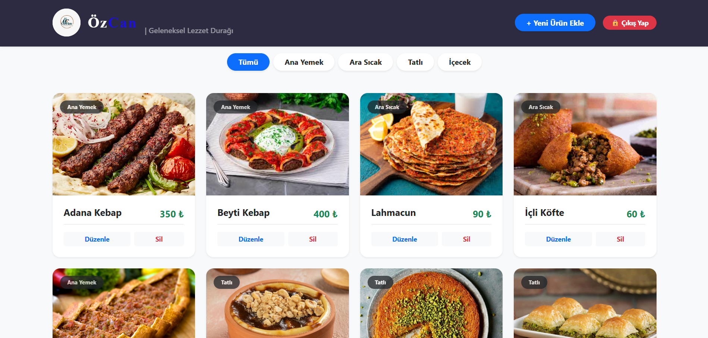
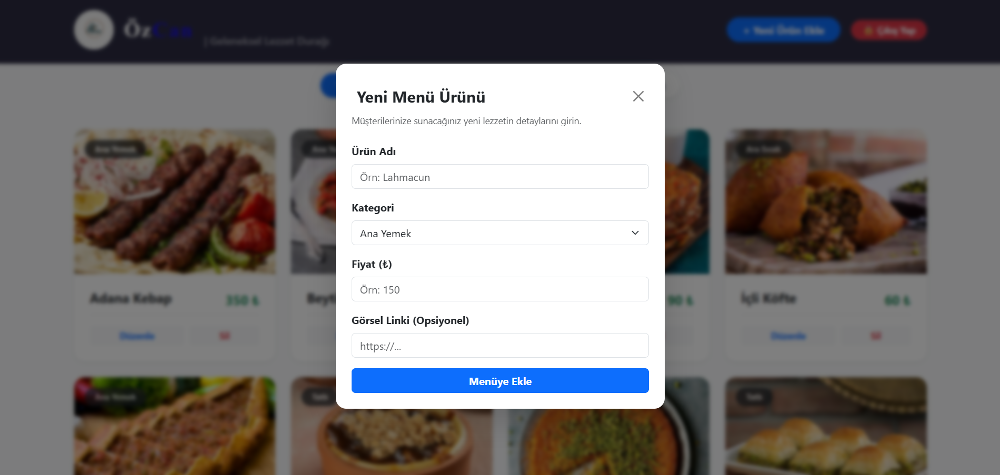

# ÖzCan Geleneksel Lezzet Durağı - QR Menü Yönetim Sistemi

Bu proje, eğitim programı çerçevesinde modern web dünyasına giriş ve kavramların bütüncül kullanımı amacıyla geliştirilmiş interaktif bir restoran QR Menü uygulamasıdır . Müşteriler için sade bir arayüz sunarken, yöneticiler için gizli bir yönetim paneli barındırır..

🔗 **Canlı Proje Linki (Netlify):** [https://ozcanqrmenu.netlify.app](https://ozcanqrmenu.netlify.app) 

## 📸 Ekran Görüntüleri

## 🚀 Proje Özellikleri ve İstenen Görevler

Yönergede belirtilen modern Javascript çerçevesi ile proje geliştirme adımları  eksiksiz uygulanmıştır:

* **Listeleme İşlemi:** Müşteriler menüdeki ürünleri kategorilere (Ana Yemek, Tatlı vb.) göre filtreleyerek listeleyebilir
* **Gizli Admin Paneli:** Yalnızca yetkililerin erişebileceği (Şifre korumalı) yönetim modülü.
* **Ekleme İşlemi:** Yönetici modunda menüye yeni ürün, görsel, fiyat ve kategori eklenebilir
* **Güncelleme İşlemi:** Mevcut ürünlerin fiyatı, ismi veya kategorisi güncellenebilir
* **Silme İşlemi:** Menüden kaldırılmak istenen ürünler tek tıkla silinebilir
* **Veri Kalıcılığı:** Veritabanı simülasyonu için tarayıcının `localStorage` API'si kullanılmıştır.

## 🛠 Kullanılan Teknolojiler

* **Frontend Framework:** ReactJS (Vite ile oluşturulmuştur )
* **Stil/Tasarım:** Bootstrap 5 & Özel CSS
* **Yayınlama (Deployment):** Netlify 
* **Sürüm Kontrolü:** Git & GitHub 

## 📁 Proje Klasör Yapısı

Yönergeye uygun olarak proje dosyaları modüler bir yapıda organize edilmiştir

* `/src/Components` : Tekrar kullanılabilir UI bileşenleri (örn: AddMenuItem.jsx)
* `/src/Pages` : Ana sayfa ve görünümler (örn: App.jsx)
* `/src/Interfaces` : Varsayılan veri modelleri ve başlangıç verileri (örn: MenuData.js)

## ⚙️ Kurulum (Geliştirici Ortamı)

Projeyi kendi bilgisayarınızda çalıştırmak için:

1. Repoyu bilgisayarınıza klonlayın.
2. Terminali açıp klasör dizinine gidin.
3. Gerekli paketleri kurmak için `npm install` komutunu çalıştırın.
4. Projeyi başlatmak için `npm run dev` komutunu kullanın.